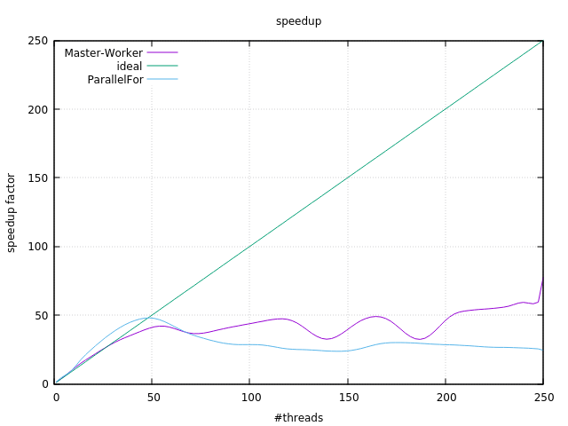
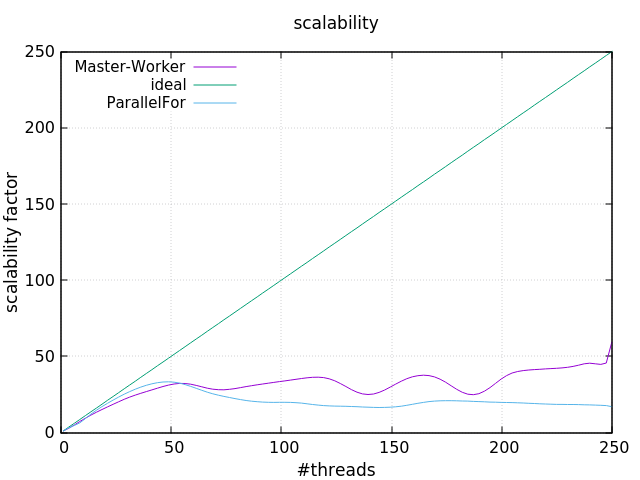

# Finding primes

This is the second assignment for the class of [Parallel and Distributed Systems](http://didawiki.di.unipi.it/doku.php/magistraleinformaticanetworking/spm/sdpm09support) @Unipi. I developed two implementations for the problem of finding prime numbers among a given range, using different patterns provided by the [FastFlow library](http://calvados.di.unipi.it/).  

The two patterns are:
* **Master Worker** farm (see file [master_worker.hpp](https://github.com/GiovanniSorice/ParallelAssigment/blob/master/FindingPrimes/master_worker.h)) and
* **Parallel For** (see file [parallel_for_exec.hpp](https://github.com/GiovanniSorice/ParallelAssigment/blob/master/FindingPrimes/parallel_for_exec.h))
  

## Getting Started

To build the project simply clone the repo and build it using the cmake file provided.


### Building
To generate the build system do:  
```
mkdir -p build
cd build
cmake ..
```
in the root of the cloned project.  

Now build the project:
```
cmake --build .
```


### Running
The executable can be found in the ```build/``` directory. Just run it with:

```./build/finding_primes``` 


## Results
The experience results are summarized in some plots that express the scalability and the speedup obtained running the code on the Xeon-phi machine.  
The benchmark depicts two situations:
* finding primes in the range 1~1mln and
* finding primes in the range 1~10mln.  
* finding primes in the range 1~40mln.  

For each scenario I computed the execution time considering 1 up to 250 threads. Following are illustrated the plots with the metrics described for the 40mln (for more information look at [benchmark folder](https://github.com/GiovanniSorice/ParallelAssigment/tree/master/FindingPrimes/report/BenchMarkFP)). 





## Authors

**Giovanni Sorice** in collaboration with my roommates and colleagues [Davide](https://github.com/dbarasti) and [Francesco](https://github.com/FraCorti)

## Acknowledgments
This project was developed for an assignment of the course [Parallel and Distributed Systems](http://didawiki.di.unipi.it/doku.php/magistraleinformaticanetworking/spm/sdpm09support) at University of Pisa under the guide of [Prof. Marco Danelutto](http://calvados.di.unipi.it/paragroup/danelutto/) and [Prof. Massimo Torquati](http://calvados.di.unipi.it/paragroup/torquati/).

